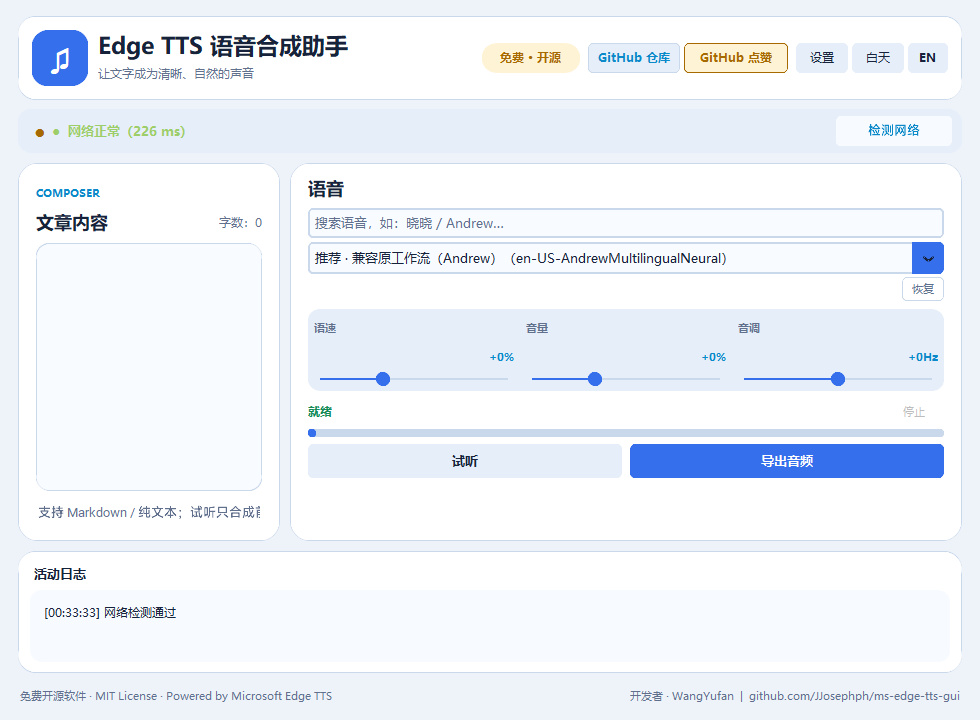
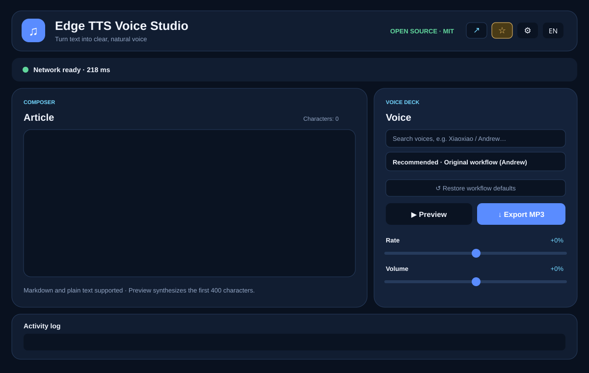
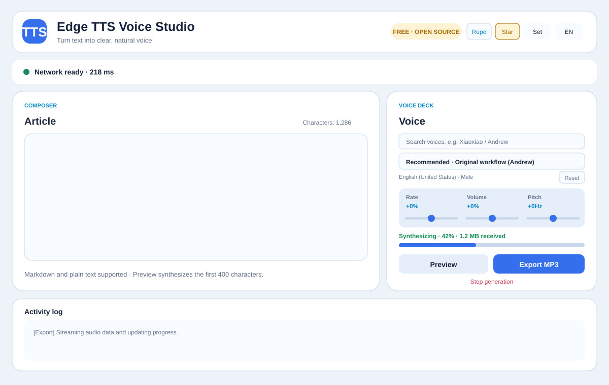

# Edge TTS Voice Studio / Edge TTS 语音合成助手

<p align="center">
  <strong>Turn text into clear, natural voice.</strong><br>
  A polished, open-source desktop client for Microsoft Edge Text-to-Speech.
</p>

<p align="center">
  <a href="https://github.com/JJosephph/ms-edge-tts-gui/releases"></a>
  <a href="LICENSE"></a>
  
  
  <a href="https://github.com/JJosephph/ms-edge-tts-gui/stargazers"></a>
</p>

<p align="center">
  <a href="#中文说明">中文说明</a> ·
  <a href="#english-guide">English guide</a> ·
  <a href="#downloads">Downloads</a> ·
  <a href="#network-and-proxy">Network &amp; proxy</a> ·
  <a href="#build-and-release">Build</a>
</p>

---

## ⭐ 求点赞 · 请先读我 / Star Us · Please Read First

> **中文**：本项目 **免费、开源（MIT License）**，开发者 **WangYufan**。
> 仓库地址：https://github.com/JJosephph/ms-edge-tts-gui
> 如果你觉得这个工具对你有帮助，请先到仓库点一个 **Star**，让更多用户能找到它；使用中遇到问题，欢迎提交 [Issue](https://github.com/JJosephph/ms-edge-tts-gui/issues) 或 PR。

> **English**: This project is **free and open source (MIT License)**, developed by **WangYufan**.
> Repository: https://github.com/JJosephph/ms-edge-tts-gui
> If this tool helps you, please **Star** the repository first so more users can discover it; issues and pull requests are welcome.

---

## 中文说明

**Edge TTS 语音合成助手**是一款免费、开源的 Windows 桌面软件（MIT License，开发者 WangYufan）。将文章、笔记、脚本等文字合成为自然的 MP3 音频，不需要 API Key。界面可随时切换中文和 English，适合全世界用户。

- **生成、试听与保存**：一键生成全文音频；生成后可随时“试听”或“保存下载”，无需重复合成。
- **实时进度**：生成时显示近似 `0–100%` 进度，完成后进度条保持 100%。
- **网络保护**：生成前检测服务连接和代理环境变量；长时间无音频数据时会提示重试。
- **语音库**：支持 Microsoft Edge 大量声音，中文模式会翻译语言、地区和性别标签。
- **兼容原工作流**：默认 `en-US-AndrewMultilingualNeural`，语速 `+0%`、音量 `+0%`、音调 `+0Hz`；另有推荐中文女声 `zh-CN-XiaoxiaoNeural`。
- **不占空间**：生成的音频只保存在一个临时 MP3 里，可自定义目录、打开或清理，关闭软件时自动删除。

### 中文界面预览

<p align="center">
  
</p>

### 下载与使用

1. 在 [Releases](https://github.com/JJosephph/ms-edge-tts-gui/releases) 下载 `EdgeTTSGui-Setup.exe`，安装时可选任意磁盘或文件夹。
2. 安装包与便携版 EXE 均已内置 Python 运行环境，Windows 10 及更高版本无需另行安装 Python。
3. 粘贴文章、选择语音、调整语速 / 音量 / 音调，点击“生成音频”合成一次；之后点“试听”播放，或点“保存下载”导出 MP3，全程无需重复合成。
4. 安装包会标明“免费 · 开源（MIT License）· 开发者 WangYufan”，支持从 Windows“设置 → 应用”或安装目录中的 `unins000.exe` 卸载。

---

## English Guide


**Edge TTS Voice Studio** is a modern Windows desktop application for turning articles, notes, scripts, documentation, and other text into high-quality MP3 audio. It is powered by the open-source [`edge-tts`](https://github.com/rany2/edge-tts) library and Microsoft Edge online voices—**no API key is required**. It is **free and open source under the MIT License**, developed by **WangYufan**.

The project is designed as a general-purpose open-source tool. It includes practical safeguards for real-world network conditions, including service reachability checks, proxy-aware diagnostics, retry controls, and a stalled-generation prompt.

## Interface Preview

<p align="center">
  
</p>

<p align="center">
  <sub>Night theme · Composer + Voice Deck workflow</sub>
</p>

<p align="center">
  
</p>

<p align="center">
  <sub>Day theme · Same focused layout, optimized for bright environments</sub>
</p>

## Features

| Area | What it provides |
| --- | --- |
| **Text to MP3** | Paste Markdown, plain text, or HTML-derived text and export a full MP3 file. |
| **Generate once, play & save** | Synthesize the full audio a single time, then Play or Save it anytime without re-rendering. |
| **Real progress** | Generation shows live, approximate `0–100%` progress plus received audio size; the bar stays at 100% when finished. |
| **Voice catalog** | Loads hundreds of Edge voices; Chinese mode renders locale and gender labels in Chinese, while English mode preserves Microsoft’s original naming. |
| **Original workflow compatibility** | Default settings mirror the existing RPA workflow: `en-US-AndrewMultilingualNeural`, rate `+0%`, volume `+0%`, pitch `+0Hz`. |
| **Recommended female voice** | `zh-CN-XiaoxiaoNeural` is prominently listed as a recommended Chinese female voice. |
| **Network protection** | Checks Edge TTS service availability and detects proxy environment variables before generation. |
| **Stall recovery** | If audio stops arriving, offers **Keep waiting**, **Retry**, or **Cancel** with a network/proxy explanation. |
| **Bilingual interface** | Toggle the desktop UI between **中文** and **English** at any time. English articles and international voices are fully supported. |
| **Day / night themes** | Switch between a bright reading-friendly theme and a focused dark workspace. |
| **Preview cache control** | Choose a preview cache folder, open it, or clear it immediately. Only one temporary preview MP3 is reused and it is deleted when the app closes. |

## Downloads

Open the [Releases](https://github.com/JJosephph/ms-edge-tts-gui/releases) page and choose the package that fits your use case:

| Package | What it is | Best for | Notes |
| --- | --- | --- | --- |
| `EdgeTTSGui-Setup.exe` | Installer (Inno Setup) | Most Windows users | Bilingual (中文/English) wizard that states **free & open source (MIT License)** and **developer WangYufan**; choose any drive/folder; desktop shortcut; **full uninstall support**; Star prompt after install. |
| `EdgeTTSGui-Portable.exe` | Single-file portable | Take-anywhere / no-install use | Python runtime and libraries bundled in one file; double-click to run; largest download. |
| `EdgeTTSGui/EdgeTTSGui.exe` | Main launcher of the folder build | Advanced / manual deployment | Small 5 MB launcher — it needs its sibling `_internal\` folder to run, so treat the whole `EdgeTTSGui\` folder as the package. |

**Which one should I download?** If you are not sure, pick `EdgeTTSGui-Setup.exe` — it installs cleanly and can be uninstalled. `EdgeTTSGui-Portable.exe` is the drop-in no-install choice.

All packages are **free and open source (MIT License)**, maintained by **WangYufan**.

### Is Python included?

**Yes.** Published EXE packages bundle the Python runtime and required libraries through PyInstaller. On Windows 10 or later, users can install or run the program without installing Python separately.

## Quick Start

### Option A — Install the Windows release

1. Download `EdgeTTSGui-Setup.exe` from [Releases](https://github.com/JJosephph/ms-edge-tts-gui/releases).
2. Run the installer and choose any destination drive or folder.
3. Launch **Edge TTS Voice Studio** from the Start menu or desktop shortcut.
4. Paste text, click **Generate Audio**, then **Play** to preview or **Save Audio** to export the MP3.

### Option B — Run from source

```bash
git clone https://github.com/JJosephph/ms-edge-tts-gui.git
cd ms-edge-tts-gui

py -3 -m venv .venv
.venv\Scripts\activate
pip install -r requirements.txt
python app.py
```

On Windows, you can also double-click `run.bat` for first-run setup and launch.

## Using the App

1. **Paste your text** into the Composer panel.
2. **Choose a voice** from the Voice Deck. The default already matches the existing RPA configuration; use **Restore workflow defaults** at any time.
3. **Adjust rate, volume, and pitch** if needed.
4. Click **Generate Audio** to synthesize the full text once.
5. After generation, click **▶ Play** to listen, or **Save Audio** to export the MP3 — both reuse the generated audio with no re-rendering.
6. Watch the status line and progress bar during generation; the bar stays at 100% when done.

## Network and Proxy

Edge TTS is an online service. The application performs a reachability test against the Edge speech endpoint and reads common proxy variables:

```text
HTTPS_PROXY   HTTP_PROXY   ALL_PROXY
https_proxy   http_proxy   all_proxy
```

If the service cannot be reached, the app reports the condition in the Activity log. If a generation stalls (no new audio data for 15 seconds), it presents a recovery dialog:

- **Keep waiting** — for a short-lived slow connection;
- **Retry** — starts the current synthesis again (up to three attempts);
- **Cancel** — stops the task and removes the partial file.

## Generated Audio Cache and Disk Usage

Generated audio is deliberately designed not to accumulate:

- The default location is the operating system temporary folder.
- Only one file, `edge_tts_preview.mp3`, is reused for the generated audio.
- It is overwritten on every new generation.
- It is removed automatically when the application exits.
- Use **⚙ Settings** to set another cache folder, open it, or clear the generated audio immediately.

When you save, the MP3 is copied to the location you choose; the cache file itself is not kept after the app closes.

## Uninstall

The installed program can be uninstalled normally:

- Open **Windows Settings → Apps → Installed apps**, find **Edge TTS 语音合成助手**, and click **Uninstall**.
- Or run `unins000.exe` in the installation directory (for example `C:\Program Files\EdgeTTSGui\unins000.exe`).

The uninstaller removes the application files and shortcuts.

## Defaults and Voice Recommendations

The compatibility preset is intentionally explicit:

```text
Voice:   en-US-AndrewMultilingualNeural
Rate:    +0%
Volume:  +0%
Pitch:   +0Hz
```

This lets existing users of the related RPA workflow start synthesizing immediately without re-entering settings. For a Chinese female voice, select the recommended `zh-CN-XiaoxiaoNeural` entry.

## Project Structure

```text
ms-edge-tts-gui/
├── app.py                       # Desktop UI, themes, localization, cache settings
├── tts_engine.py                # Edge TTS streaming, progress, network and stall handling
├── text_utils.py                # Markdown/HTML cleanup and preview text extraction
├── assets/                      # Icon and README interface previews
├── installer/EdgeTTSGui.iss     # Inno Setup installer definition
├── run.bat                      # Windows source launcher
├── build_release.bat            # Builds directory app, portable EXE, and installer
└── .github/workflows/           # Tagged-release automation
```

## Build and Release

### Local Windows build

```bat
build_release.bat
```

The script builds:

```text
dist\EdgeTTSGui\EdgeTTSGui.exe
dist\EdgeTTSGui-Portable.exe
dist\EdgeTTSGui-Setup.exe
```

The installer is generated with Inno Setup and includes the bundled application runtime.

### GitHub release automation

Pushing a version tag matching `v*` runs `.github/workflows/build-release.yml`. The workflow builds the Windows directory app, the portable EXE, and the Inno Setup installer, then uploads them to a GitHub Release.

```bash
git tag v1.1.0
git push origin v1.1.0
```

## Privacy and Service Notice

- Text is sent to Microsoft Edge’s online speech service only to synthesize the requested audio.
- This application does not require an API key and does not add its own telemetry service.
- The project is not affiliated with or endorsed by Microsoft.
- Please use online voices in accordance with the applicable service terms and local laws.

## Contributing

Issues, feature requests, and pull requests are welcome. If this project helps you, please consider giving it a **Star** on GitHub—it makes the project easier for other users to discover.

## License

Released under the [MIT License](LICENSE).

- **Maintainer:** WangYufan
- **Repository:** https://github.com/JJosephph/ms-edge-tts-gui