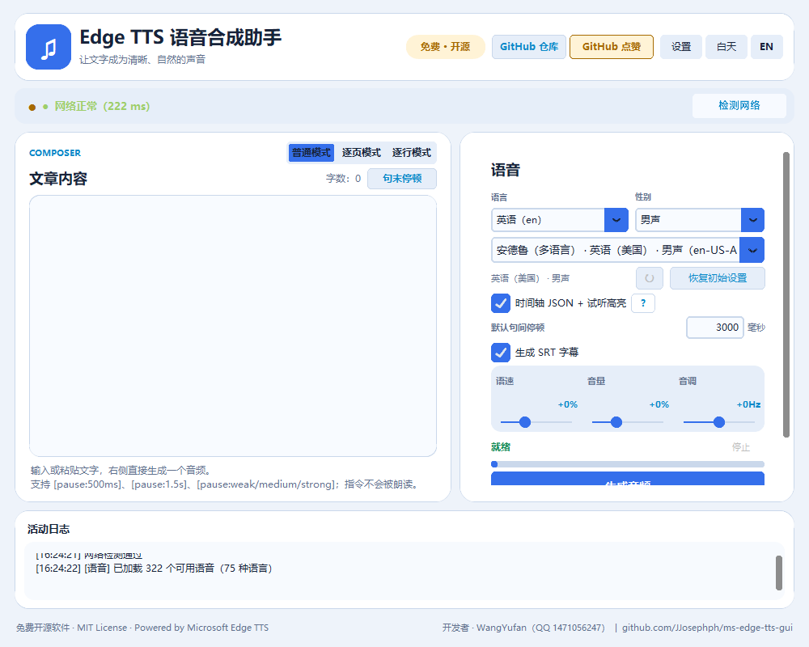
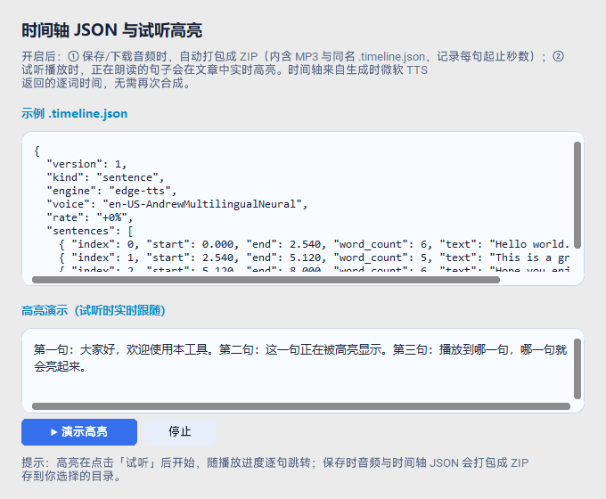
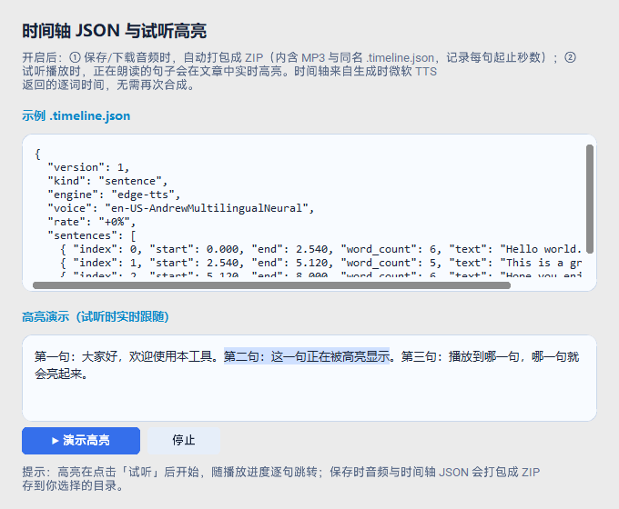

# Edge TTS Voice Studio / Edge TTS 语音合成助手

<p align="center">
  <strong>Turn text into clear, natural voice.</strong><br>
  A polished, open-source desktop client for Microsoft Edge Text-to-Speech.
</p>

<p align="center">
  <a href="https://github.com/JJosephph/ms-edge-tts-gui/releases"></a>
  <a href="LICENSE"></a>
  
  
  <a href="https://github.com/JJosephph/ms-edge-tts-gui/stargazers"></a>
</p>

<p align="center">
  <a href="#中文说明">中文说明</a> ·
  <a href="#english-guide">English guide</a> ·
  <a href="#downloads">Downloads</a> ·
  <a href="#network-and-proxy">Network &amp; proxy</a> ·
  <a href="#build-and-release">Build</a>
</p>

---

## ⭐ 求点赞 · 请先读我 / Star Us · Please Read First

> **中文**：本项目 **免费、开源（MIT License）**，开发者 **WangYufan**（QQ 1471056247）。
> 仓库地址：https://github.com/JJosephph/ms-edge-tts-gui
> 如果你觉得这个工具对你有帮助，请先到仓库点一个 **Star**，让更多用户能找到它；使用中遇到问题，欢迎提交 [Issue](https://github.com/JJosephph/ms-edge-tts-gui/issues) 或 PR。

> **English**: This project is **free and open source (MIT License)**, developed by **WangYufan** (QQ 1471056247).
> Repository: https://github.com/JJosephph/ms-edge-tts-gui
> If this tool helps you, please **Star** the repository first so more users can discover it; issues and pull requests are welcome.

---

## 中文说明

**Edge TTS 语音合成助手**是一款免费、开源的 Windows 桌面软件（MIT License，开发者 WangYufan）。它把文章、脚本和字幕文稿合成为自然的 MP3 音频，不需要 API Key。软件提供**普通、逐页、逐行**三种工作模式，并支持独立句间停顿、行末真实静音、SRT 字幕、时间轴 JSON、逐句试听高亮、可拖动播放进度和批量 ZIP 导出。界面可随时切换中文和 English，适合旁白制作、视频剪辑、跟读学习和批量配音。

- **生成、试听与保存**：一键生成全文音频；生成后可随时“试听”或“保存下载”，无需重复合成。
- **三种工作模式**：普通模式直接读取输入框全文；逐页模式按 `[分页]` 标记生成一页一个音频；逐行模式按每个非空行生成一个音频。
- **实时进度**：生成时显示近似 `0–100%` 进度，完成后进度条保持 100%。
- **时间轴 JSON + 试听高亮**：主界面勾选后，保存/下载时自动打包 ZIP（内含 MP3 与同名 `.timeline.json`，每句起止秒数）；试听时正在朗读的句子会在文章中实时高亮。
- **结果表格浏览器**：批量结果按行展示文字、句级时间轴、试听和重新生成操作；悬停会高亮对应行，修改后的单行可以直接重新生成并继续导出最终 ZIP。
- **可拖动播放时间轴**：每行显示已播放秒数/总时长，绿色滑块可拖动跳转；播放进度和行末静音段都包含在总时长中。
- **独立句间停顿**：用毫秒精确设置每句话之间的静音间隔，不改变人声本身的语速；时间轴和字幕会同步后移。
- **行末停顿**：逐行模式可在整行音频后追加真实静音；这段时间没有人声但进度继续走，时间轴会标注“行末静音”。
- **SRT 字幕**：勾选“生成 SRT 字幕”后，每句对应一条字幕，时间严格匹配最终音频，可随 MP3 一起导出。
- **网络保护**：生成前检测服务连接和代理环境变量；长时间无音频数据时会提示重试。
- **三级语音选择**：语音一次性从远端拉取后在本地按 **语言 → 性别 → 音色** 分组（内置分组引擎），不用再大海捞针；默认保留 `en-US-AndrewMultilingualNeural`（英语男声），可随时自选。
- **音色自然丰富**：支持几百种语言、数百个音色，男声、女声都非常丰富；无论中文、粤语、英语还是其他外语，都是十分自然的 TTS 朗读，不是机器音——用过 Edge 朗读功能的人都懂。
- **兼容原工作流**：默认 `en-US-AndrewMultilingualNeural`，语速 `+0%`、音量 `+0%`、音调 `+0Hz`；「恢复初始设置」可一键还原。
- **不占空间**：生成的音频只保存在一个临时 MP3 里，可自定义目录、打开或清理，关闭软件时自动删除。
- **文件导入与示例**：逐页、逐行模式支持 `txt / md / docx / pdf`；界面提供示例 TXT 下载按钮，方便按正确格式准备 100 行以上的批量文稿。

### 中文界面预览

<p align="center">
  
</p>
<p align="center">
  <sub>普通模式：不要求分页，直接把左侧输入框的完整文稿生成一个音频；右侧可设置句间停顿、SRT 字幕和时间轴。</sub>
</p>

<p align="center">
  <sub>当前版本主界面截图：普通模式默认直接生成一个音频；切换到逐页或逐行模式后，可导入示例 TXT 并批量导出。</sub>
</p>

### 亮点功能：时间轴 JSON + 试听逐句高亮

这是本工具最值得一试的功能。在主界面勾选「时间轴 JSON + 试听高亮」后：

- **保存即打包 ZIP**：点击「保存下载」时，自动生成一个 ZIP 压缩包，里面同时包含 MP3 和同名 `.timeline.json`——每句话的起止秒数清清楚楚，不用手动配对；
- **试听实时高亮**：点击「试听」后，正在朗读的句子会在原文中逐句点亮，像 K 歌字幕一样跟着进度走，跟读复习特别方便；
- **精准且零额外合成**：MP3 与时间轴在同一次请求中生成，时间轴直接使用微软 TTS 返回的句级边界，**不需要再次合成**，纯本地保存、完全免费、无需 API Key。

<p align="center">
  
  
</p>

`.timeline.json` 内容示例：

```json
{
  "boundary": "SentenceBoundary",
  "sentences": [
    { "index": 0, "text": "你好，欢迎使用 Edge TTS 语音合成助手。", "start": 0.00, "end": 3.12 },
    { "index": 1, "text": "时间轴来自微软 TTS 的句级边界，无需二次合成。", "start": 3.12, "end": 6.80 }
  ]
}
```

> 适用场景：视频字幕、剪辑对齐、外语跟读、逐句复习、播客文稿等。

### 三种工作模式

#### 1. 普通模式

默认模式无需导入文件，也不要求分页。把完整文稿粘贴到左侧输入框，点击「**生成音频**」即可得到一个 MP3。输入框里的换行只作为朗读文本的一部分，不会自动拆成多个文件。

#### 2. 逐页模式

适合按章节、镜头或段落生成音频。点击「**导入文件**」选择 `txt / md / docx / pdf`，TXT/Markdown 推荐使用单独一行的 `[分页]` 标记：

```text
这是第一页的内容。
[分页]
这是第二页的内容。
[分页]
这是第三页的内容。
```

`[分页]` 不会被朗读。没有显式标记时，文本中的空行块也可以作为页面。每页支持备注，备注不会朗读，会写入 `pages.json`。点击「**逐页配音**」后，每页生成一个 MP3，最后可导出 ZIP。

#### 3. 逐行模式

适合视频解说、短句旁白和批量字幕。可以导入 TXT，也可以直接粘贴文本后点击「**按行准备**」：每个非空行生成一个独立音频，空行自动忽略。

```text
第一句旁白，生成 line_001.mp3
第二句旁白，生成 line_002.mp3
第三句旁白，生成 line_003.mp3
```

点击「**逐行配音**」后，软件按行顺序合成，完成后保存为 ZIP，包含 `line_001.mp3`、`line_002.mp3` 等音频以及 `lines.json`。打开「查看结果」后，可切换“当前音频 / 全部字幕”，在同一行编辑文字、查看时间轴、试听、拖动进度和重新生成；全部确认后可直接导出最终 ZIP。逐页和逐行模式都提供「**示例文件**」按钮。

### 句间停顿与字幕

- 在右侧「**默认句间停顿**」输入毫秒数（`0–10000 ms`），设置值会覆盖 Edge TTS 原生句间空隙，最终静音时长按毫秒精确生效，不改变人声语速。
- 逐行模式开启「**行末停顿**」后，每个独立音频末尾会追加对应毫秒数的真实静音；它不会改变前面的语音速度，播放时进度条会继续经过这段无声区间。
- 点击编辑区上方「**句末停顿**」可批量插入停顿指令；也可以手动写入 `[pause:500ms]`、`[pause:1.5s]`、`[pause:weak]`、`[pause:medium]`、`[pause:strong]` 或 `[pause]`。这些指令不会被朗读，单句指令优先于全局默认值。
- 开启「**生成 SRT 字幕**」后，每句生成一条字幕；字幕时间会包含句间停顿，和最终 MP3 严格对应。
- 开启「**时间轴 JSON + 试听高亮**」后，可同时导出 `.timeline.json`；批量 ZIP 会按每页或每行保存对应的 MP3、SRT 和时间轴文件。

```text
lines_archive.zip
├── line_001.mp3
├── line_001.srt       # 开启 SRT 时生成
├── line_002.mp3
├── line_002.srt
└── lines.json         # 文本、备注、音频、时间轴和字幕文件名
```

### 下载与使用

1. 在 [Releases](https://github.com/JJosephph/ms-edge-tts-gui/releases) 下载 `EdgeTTSGui-Setup.exe`，安装时可选任意磁盘或文件夹。
2. 安装包与便携版 EXE 均已内置 Python 运行环境，Windows 10 及更高版本无需另行安装 Python。
3. 粘贴文章、选择语音、调整语速 / 音量 / 音调，点击“生成音频”合成一次；之后点“试听”播放，或点“保存下载”导出 MP3，全程无需重复合成。
4. 安装包会标明“免费 · 开源（MIT License）· 开发者 WangYufan”，支持从 Windows“设置 → 应用”或安装目录中的 `unins000.exe` 卸载。

---

## English Guide


**Edge TTS Voice Studio** is a modern Windows desktop application for turning articles, notes, scripts, documentation, and other text into high-quality MP3 audio. It is powered by the open-source [`edge-tts`](https://github.com/rany2/edge-tts) library and Microsoft Edge online voices—**no API key is required**. It is **free and open source under the MIT License**, developed by **WangYufan**.

The project is designed as a general-purpose open-source tool with three focused work modes: **Normal** mode for one complete text box, **Page** mode for `[分页]`-separated document batches, and **Line** mode for one audio file per non-empty line. It also supports independent sentence pauses in milliseconds, optional SRT subtitles, timeline JSON, live sentence highlighting, example TXT files, and ZIP export for page or line batches. A **Language → Gender → Voice** cascading picker covers hundreds of voices, while service reachability checks, proxy-aware diagnostics, retry controls, and a stalled-generation prompt help with real-world network conditions.

## Interface Preview

<p align="center">
  
</p>

<p align="center">
  <sub>English UI · Dark theme · Normal mode composer with sentence pause, SRT, and timeline controls</sub>
</p>

<p align="center">
  <sub>Current release preview · switch to Page or Line mode for import, review, and batch export.</sub>
</p>

## Features

| Area | What it provides |
| --- | --- |
| **Text to MP3** | Paste Markdown, plain text, or HTML-derived text and export a full MP3 file. |
| **Three work modes** | **Normal** reads the composer text as one audio file. **Page** imports `txt / md / docx / pdf`, splits on a standalone `[分页]` marker (or blank-line blocks when no marker is present), and creates one audio file per page. **Line** imports a file or prepared text and creates one audio file for every non-empty line. |
| **Batch page / line export** | Page and line modes show ordered progress and export numbered MP3 files plus `pages.json` or `lines.json`; optional SRT, timeline JSON, and source notes are included with the matching item. A downloadable example TXT is available in both batch modes. |
| **Generate once, play & save** | Synthesize the full audio a single time, then Play or Save it anytime without re-rendering. |
| **Real progress** | Generation shows live, approximate `0–100%` progress plus received audio size; the bar stays at 100% when finished. |
| **Multi-level voice picker** | Voices are fetched once and grouped locally into **Language → Gender → Voice** (built-in grouping engine) — no more scrolling a giant list. Male/female voices are rich across hundreds of languages; Chinese, Cantonese, English and more all sound natural, never robotic. |
| **Original workflow compatibility** | Default settings mirror the existing RPA workflow: `en-US-AndrewMultilingualNeural`, rate `+0%`, volume `+0%`, pitch `+0Hz`. |
| **Timeline JSON + highlight** | Optional one-click toggle on the main UI: saving bundles the MP3 and a `.timeline.json` (each sentence's start/end seconds) into one ZIP, and during Play the sentence being read is highlighted live in the article. A " ? " help button shows a JSON example and a highlight demo. |
| **Independent sentence pause** | Add silence between sentences in precise milliseconds without changing the voice's speaking rate. The pause is reflected in audio duration, timeline JSON, and SRT timestamps. |
| **SRT subtitles** | Generate one SRT cue per sentence. Timings match the final audio, including configured sentence pauses; batch ZIP exports place the subtitle beside its MP3. |
| **Restore defaults** | The voice-deck button resets voice to `en-US-AndrewMultilingualNeural` and rate/volume/pitch to `+0%`/`+0%`/`+0Hz` in one click. |
| **Recommended female voice** | `zh-CN-XiaoxiaoNeural` is prominently listed as a recommended Chinese female voice. |
| **Network protection** | Checks Edge TTS service availability and detects proxy environment variables before generation. |
| **Stall recovery** | If audio stops arriving, offers **Keep waiting**, **Retry**, or **Cancel** with a network/proxy explanation. |
| **Bilingual interface** | Toggle the desktop UI between **中文** and **English** at any time. English articles and international voices are fully supported. |
| **Day / night themes** | Switch between a bright reading-friendly theme and a focused dark workspace. |
| **Preview cache control** | Choose a preview cache folder, open it, or clear it immediately. Only one temporary preview MP3 is reused and it is deleted when the app closes. |

### ⭐ Key Feature: Timeline JSON + Live Sentence Highlight

The feature we are most proud of — enable the **Timeline JSON + highlight** toggle on the main UI:

- **Save = one ZIP**: clicking **Save Audio** produces a single ZIP that bundles the MP3 with its `.timeline.json` (start/end seconds for every sentence) — nothing to pair up by hand;
- **Live highlight while playing**: the sentence being read lights up in the article in real time, sentence by sentence — great for shadowing, subtitles and review;
- **Precise with no extra synthesis**: the MP3 and timeline are produced in the same request, using sentence-boundary metadata returned directly by Microsoft TTS. **No re-rendering** is needed; files are saved locally, free, with no API key.

<p align="center">
  
  
</p>

Example `.timeline.json`:

```json
{
  "boundary": "SentenceBoundary",
  "sentences": [
    { "index": 0, "text": "Hello, welcome to Edge TTS Voice Studio.", "start": 0.00, "end": 3.12 },
    { "index": 1, "text": "The timeline uses Microsoft TTS sentence boundaries, no re-render needed.", "start": 3.12, "end": 6.80 }
  ]
}
```

> Use cases: subtitles, video editing alignment, language shadowing, sentence-by-sentence review, podcast transcripts.

## Downloads

Open the [Releases](https://github.com/JJosephph/ms-edge-tts-gui/releases) page and choose the package that fits your use case:

| Package | What it is | Best for | Notes |
| --- | --- | --- | --- |
| `EdgeTTSGui-Setup.exe` | Installer (Inno Setup) | Most Windows users | Bilingual (中文/English) wizard that states **free & open source (MIT License)** and **developer WangYufan**; choose any drive/folder; desktop shortcut; **full uninstall support**; Star prompt after install. |
| `EdgeTTSGui-Portable.exe` | Single-file portable | Take-anywhere / no-install use | Python runtime and libraries bundled in one file; double-click to run; largest download. |
| `EdgeTTSGui/EdgeTTSGui.exe` | Main launcher of the folder build | Advanced / manual deployment | Small 5 MB launcher — it needs its sibling `_internal\` folder to run, so treat the whole `EdgeTTSGui\` folder as the package. |

**Which one should I download?** If you are not sure, pick `EdgeTTSGui-Setup.exe` — it installs cleanly and can be uninstalled. `EdgeTTSGui-Portable.exe` is the drop-in no-install choice.

All packages are **free and open source (MIT License)**, maintained by **WangYufan**.

### Is Python included?

**Yes.** Published EXE packages bundle the Python runtime and required libraries through PyInstaller. On Windows 10 or later, users can install or run the program without installing Python separately.

## Quick Start

### Option A — Install the Windows release

1. Download `EdgeTTSGui-Setup.exe` from [Releases](https://github.com/JJosephph/ms-edge-tts-gui/releases).
2. Run the installer and choose any destination drive or folder.
3. Launch **Edge TTS Voice Studio** from the Start menu or desktop shortcut.
4. Paste text, click **Generate Audio**, then **Play** to preview or **Save Audio** to export the MP3.

### Option B — Run from source

```bash
git clone https://github.com/JJosephph/ms-edge-tts-gui.git
cd ms-edge-tts-gui

py -3 -m venv .venv
.venv\Scripts\activate
pip install -r requirements.txt
python app.py
```

On Windows, you can also double-click `run.bat` for first-run setup and launch.

## Using the App

1. **Choose a mode**. Normal mode is the default and needs only the Composer text box. Page and Line modes are selected manually when you want batch output.
2. **Choose a voice** from the Voice Deck — pick **Language**, then **Gender**, then the final **Voice** from the filtered list. The default is the English male voice `en-US-AndrewMultilingualNeural`; use **Restore defaults** at any time to reset voice and rate/volume/pitch.
3. **Adjust rate, volume, pitch, and sentence pause** if needed. Sentence pause is silence between sentences and is measured in milliseconds.
4. In **Normal** mode, paste a complete script and click **Generate Audio** to create one MP3. Newlines remain part of the same narration.
5. In **Page** mode, click **Import File**, choose `txt / md / docx / pdf`, review pages, and use **Dub All Pages** to synthesize one MP3 per page. A standalone `[分页]` line is the explicit page separator; the marker is not spoken.
6. In **Line** mode, import a TXT or paste prepared text, then choose **Prepare Lines**. Every non-empty line becomes one item; click **Dub All Lines** to synthesize `line_001.mp3`, `line_002.mp3`, and so on.
7. Enable **Generate SRT subtitles** when you want one subtitle cue per sentence. Page and line batches can be saved as a ZIP with the numbered MP3 files, matching SRT/timeline files, and `pages.json` or `lines.json`.
8. After generation, click **Play** to listen or **Save Audio** to export. Watch the status line and progress bar during generation; the bar stays at 100% when done.

## Network and Proxy

Edge TTS is an online service. The application performs a reachability test against the Edge speech endpoint and reads common proxy variables:

```text
HTTPS_PROXY   HTTP_PROXY   ALL_PROXY
https_proxy   http_proxy   all_proxy
```

If the service cannot be reached, the app reports the condition in the Activity log. If a generation stalls (no new audio data for 3 minutes), it presents a recovery dialog:

- **Keep waiting** — for a short-lived slow connection;
- **Retry** — starts the current synthesis again (up to three attempts);
- **Cancel** — stops the task and removes the partial file.

## Generated Audio Cache and Disk Usage

Generated audio is deliberately designed not to accumulate:

- The default location is the operating system temporary folder.
- Only one file, `edge_tts_preview.mp3`, is reused for the generated audio.
- It is overwritten on every new generation.
- It is removed automatically when the application exits.
- Use **⚙ Settings** to set another cache folder, open it, or clear the generated audio immediately.

When you save, the MP3 is copied to the location you choose; the cache file itself is not kept after the app closes.

## Uninstall

The installed program can be uninstalled normally:

- Open **Windows Settings → Apps → Installed apps**, find **Edge TTS 语音合成助手**, and click **Uninstall**.
- Or run `unins000.exe` in the installation directory (for example `C:\Program Files\EdgeTTSGui\unins000.exe`).

The uninstaller removes the application files and shortcuts.

## Defaults and Voice Recommendations

The compatibility preset is intentionally explicit:

```text
Voice:   en-US-AndrewMultilingualNeural
Rate:    +0%
Volume:  +0%
Pitch:   +0Hz
```

This lets existing users of the related RPA workflow start synthesizing immediately without re-entering settings; the deck's **Restore defaults** button returns to this preset in one click. For a Chinese female voice, pick 中文 → 女声 → 晓晓 (`zh-CN-XiaoxiaoNeural`).

## Project Structure

```text
ms-edge-tts-gui/
├── app.py                       # Desktop UI, themes, localization, cache settings
├── tts_engine.py                # Edge TTS streaming, progress, network and stall handling
├── text_utils.py                # Markdown/HTML cleanup and preview text extraction
├── voice_groups.py              # Local grouping engine: Language → Gender → Voice
├── page_import.py                # Import txt/md/docx/pdf and split into pages or non-empty lines

├── assets/                      # Icon and README interface previews
├── installer/EdgeTTSGui.iss     # Inno Setup installer definition
├── run.bat                      # Windows source launcher
├── build_release.bat            # Builds directory app, portable EXE, and installer
└── .github/workflows/           # Tagged-release automation
```

## Build and Release

### Local Windows build

```bat
build_release.bat
```

The script builds:

```text
dist\EdgeTTSGui\EdgeTTSGui.exe
dist\EdgeTTSGui-Portable.exe
dist\EdgeTTSGui-Setup.exe
```

The installer is generated with Inno Setup and includes the bundled application runtime.

### GitHub release automation

Pushing a version tag matching `v*` runs `.github/workflows/build-release.yml`. The workflow builds the Windows directory app, the portable EXE, and the Inno Setup installer, then uploads them to a GitHub Release.

```bash
git tag v1.4.1
git push origin v1.4.1
```

## Privacy and Service Notice

- Text is sent to Microsoft Edge’s online speech service only to synthesize the requested audio.
- This application does not require an API key and does not add its own telemetry service.
- The project is not affiliated with or endorsed by Microsoft.
- Please use online voices in accordance with the applicable service terms and local laws.

## Contributing

Issues, feature requests, and pull requests are welcome. If this project helps you, please consider giving it a **Star** on GitHub—it makes the project easier for other users to discover.

## License

Released under the [MIT License](LICENSE) · 中文版见 [LICENSE.zh.txt](LICENSE.zh.txt).

- **Maintainer:** WangYufan（QQ 1471056247）
- **Repository:** https://github.com/JJosephph/ms-edge-tts-gui
