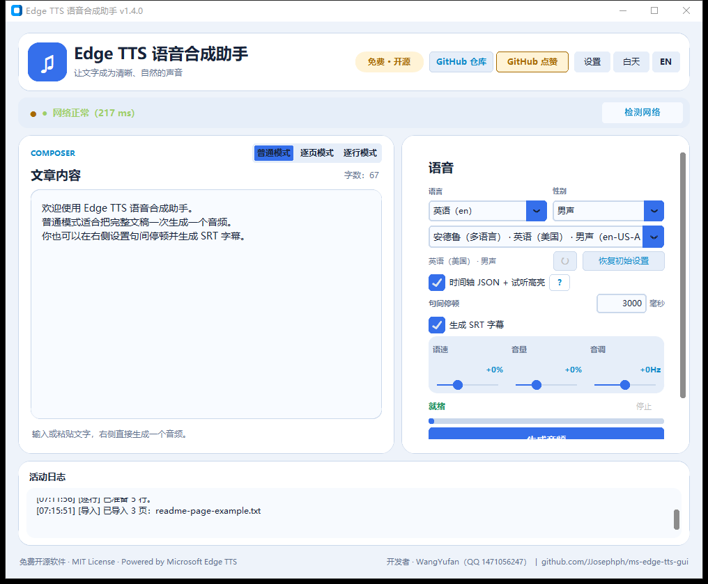
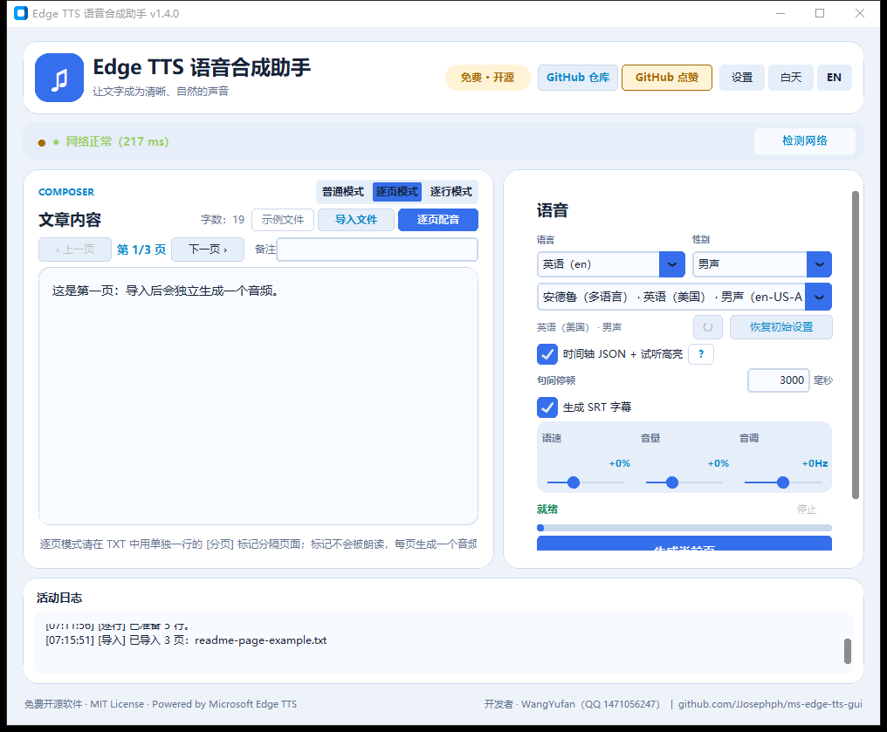
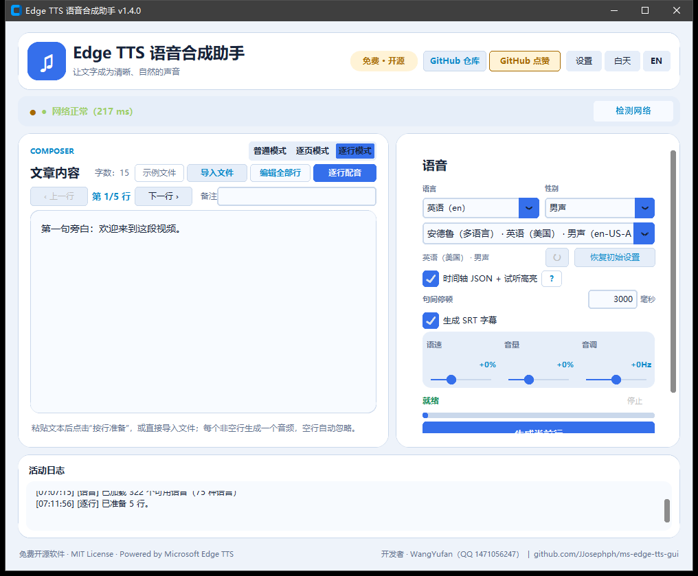
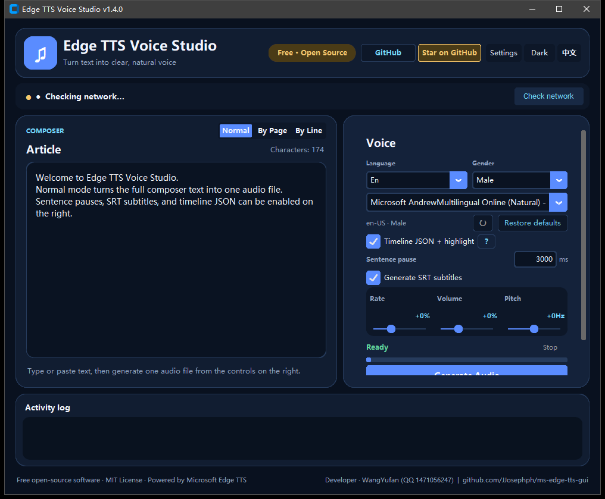

# Edge TTS 语音合成助手 v1.4.0 宣传发布包

这份文档用于发布 v1.4.0 的项目介绍、平台文案、配图和搜索关键词。各平台不要完全复制同一篇，按下面的版本做轻量改写即可。

## 统一信息

- 项目名称：Edge TTS 语音合成助手 / Edge TTS Voice Studio
- 当前版本：v1.4.0
- 项目类型：免费、开源、MIT License、Windows 桌面 TTS 工具
- 核心场景：视频旁白、批量配音、字幕制作、语言跟读、文章听读
- 项目地址：<https://github.com/JJosephph/ms-edge-tts-gui>
- 主要功能：普通模式、逐页模式、逐行模式、句间停顿、SRT 字幕、时间轴 JSON、逐句试听高亮、ZIP 批量导出

## 配图顺序

1. `ui-v14-normal.png`：普通模式，输入框直接生成全文音频
2. `ui-v14-page.png`：逐页模式，导入 TXT 后按 `[分页]` 生成页面音频
3. `ui-v14-line.png`：逐行模式，每个非空行生成一个独立音频
4. `ui-v14-english.png`：英文深色界面，适合英文帖子或海外平台

### 配图预览

## 主推文

### 标题

免费开源的 Edge TTS 配音工具 v1.4.0：逐行生成音频、句间停顿、SRT 字幕一次搞定

### 正文

做视频旁白、影视解说或批量配音时，最麻烦的往往不是合成声音，而是把几十、几百行文稿拆成独立音频，再回头处理停顿和字幕。

我做了一个免费的 Windows 桌面工具：**Edge TTS 语音合成助手 v1.4.0**。

这次重点加入了三种工作模式：

- **普通模式**：左侧输入框直接生成一个完整音频，不要求分页；
- **逐页模式**：导入 TXT / Markdown / DOCX / PDF，用单独一行的 `[分页]` 分隔页面，一页一个音频；
- **逐行模式**：导入 TXT 或直接粘贴文本，每个非空行生成一个独立音频，适合 100 行、200 行的短句旁白。

另外还支持：

- 句间停顿，精确到毫秒，不改变人声本身语速；
- 每句对应一条 SRT 字幕，时间匹配最终音频；
- 时间轴 JSON 和试听时的逐句高亮；
- 逐页 / 逐行批量生成并导出 ZIP；
- 内置示例 TXT，减少格式准备成本；
- 中英文界面、丰富 Edge TTS 音色、无需 API Key。

如果你一直在找“TXT 按行生成 MP3”“一行一个音频”“配音同时生成 SRT”的工具，可以试试这个项目。

项目地址：<https://github.com/JJosephph/ms-edge-tts-gui>

欢迎 Star、试用和提交 Issue。截图与完整使用说明已放在 README。

### 主推文标签

`#EdgeTTS` `#语音合成` `#AI配音` `#视频旁白` `#批量配音` `#SRT字幕` `#开源软件` `#Windows工具` `#Python项目`

## 20 个平台发布文案

### 1. GitHub Release / Discussions

**标题：** Edge TTS Voice Studio v1.4.0：三种批量配音模式与 SRT 字幕

**正文：**

Edge TTS Voice Studio v1.4.0 is now available. It is a free, open-source Windows desktop client for Microsoft Edge TTS, with no API key required.

Highlights: Normal mode for one complete script, Page mode for `[分页]`-separated documents, Line mode for one MP3 per non-empty line, millisecond sentence pauses, sentence-level SRT subtitles, timeline JSON, live sentence highlighting, and ZIP batch export.

Useful for video narration, subtitle workflows, language shadowing, and large TXT batches. Feedback and feature requests are welcome.

**配图：** `ui-v14-normal.png` + `ui-v14-line.png`

### 2. Gitee

**标题：** Edge TTS 语音合成助手 v1.4.0：免费开源 Windows 批量配音工具

**正文：**

v1.4.0 适合需要把文章、脚本、字幕文稿快速变成 MP3 的用户。默认普通模式直接生成全文；切换逐页模式后可以按 `[分页]` 一页一个音频；逐行模式则是每个非空行一个独立音频。句间停顿支持毫秒级设置，开启 SRT 后每句字幕会跟随最终音频时间。支持 TXT / MD / DOCX / PDF 导入、示例文件和 ZIP 批量导出。MIT License，欢迎 Star 与 Issue。

**配图：** `ui-v14-page.png` + `ui-v14-line.png`

### 3. GitCode

**标题：** 一个真正按行批量生成音频的 Edge TTS GUI

**正文：**

很多工具会把整份 TXT 合成为一个音频。这个项目把工作流拆成三种模式：普通模式、逐页模式和逐行模式。逐行模式会跳过空行，为每个非空行生成独立 MP3，并可批量导出 ZIP。v1.4.0 同时支持句间静音、SRT 字幕、时间轴 JSON 和试听高亮。适合视频解说、短句旁白和字幕制作。

**配图：** `ui-v14-line.png`

### 4. 腾讯云开发者社区

**标题：** 我做了一个按行生成 MP3 的开源 Edge TTS 桌面工具

**正文：**

影视解说和短视频旁白经常是一行十几个字，理想结果是“一行一个音频”，但普通 TTS 工具往往把整篇 TXT 合成一个文件。Edge TTS 语音合成助手 v1.4.0 解决了这个流程问题：导入或粘贴文本后切换到逐行模式，按行准备，再批量生成；同时可以设置句间停顿、生成逐句 SRT，并把结果打包成 ZIP。普通模式和逐页模式仍然保留，互不干扰。项目免费开源，欢迎体验并反馈。

**配图：** `ui-v14-line.png` + `ui-v14-normal.png`

### 5. 稀土掘金

**标题：** v1.4.0 发布：Edge TTS GUI 支持逐行配音和自动 SRT

**正文：**

这次更新主要围绕“批量旁白生产”做了完整工作流：普通模式输入全文，逐页模式按 `[分页]` 生成页面音频，逐行模式按非空行生成独立音频。句间停顿单独控制，单位是毫秒，不会改变人声速度；SRT 按句生成并匹配最终时间轴；批量任务可以导出 ZIP。对 Python、Edge TTS、视频剪辑和字幕自动化感兴趣的朋友，欢迎看看项目实现和 README。

**配图：** `ui-v14-page.png` + `ui-v14-line.png`

### 6. CSDN

**标题：** Windows 免费配音工具：TXT 每行生成一个 MP3，还能自动生成 SRT

**正文：**

如果你有 100 行、200 行旁白稿，需要一行一个音频，这个开源项目可以直接处理。v1.4.0 提供普通、逐页、逐行三种模式：普通模式生成整篇，逐页模式按 `[分页]` 拆分，逐行模式按每个非空行拆分。除了 Edge TTS 音色，还加入了句间停顿、SRT 字幕、时间轴 JSON、逐句高亮和 ZIP 批量导出。支持 Windows，免费开源，无需 API Key。

**配图：** `ui-v14-line.png` + `ui-v14-page.png`

### 7. SegmentFault 思否

**标题：** 求反馈：一个面向视频旁白的 Edge TTS 批量配音 GUI

**正文：**

分享一个刚完成 v1.4.0 的 Windows 开源项目。它解决的是配音工作中的拆分问题：普通模式整篇生成，逐页模式按 `[分页]` 分页，逐行模式每个非空行一个音频。右侧可以独立设置句间静音，另有 SRT、时间轴 JSON 和试听高亮。希望听听大家对导入格式、批量导出、字幕时间和 UI 工作流的建议。

**配图：** `ui-v14-normal.png`

### 8. 开源中国 OSCHINA

**标题：** Edge TTS 语音合成助手 v1.4.0 发布

**正文：**

Edge TTS 语音合成助手是一款免费、开源的 Windows 桌面 TTS 工具。v1.4.0 新增三种工作模式：普通模式、逐页模式、逐行模式；支持 TXT / MD / DOCX / PDF 导入，逐行批量生成 MP3，句间停顿毫秒级设置，逐句 SRT 字幕，时间轴 JSON，试听高亮和 ZIP 导出。适用于视频旁白、影视解说、跟读学习和批量配音。欢迎试用、Star 和提交 Issue。

**配图：** `ui-v14-page.png` + `ui-v14-line.png`

### 9. V2EX

**标题：** [分享] 做了一个按行批量生成 Edge TTS 音频的 Windows 工具

**正文：**

最近做了一个自己的旁白工作流工具，v1.4.0 已经整理好。它有普通、逐页、逐行三种模式，最核心的是逐行模式：TXT 里每个非空行生成一个独立 MP3。还支持句间停顿、SRT、时间轴 JSON 和 ZIP 批量导出。项目免费开源，欢迎大家帮忙看看还有哪些交互或格式处理值得改进。

**配图：** `ui-v14-line.png`

### 10. 知乎

**标题：** 有没有能把 TXT 每一行分别生成音频的免费工具？我做了一个

**正文：**

很多视频作者需要把一百多行短句变成一百多个音频文件，但直接导入 TXT 常常只得到一个整篇音频。我的解决方案是做一个 Windows 桌面工具：Edge TTS 语音合成助手 v1.4.0。切换到逐行模式后，每个非空行都会独立合成；需要整篇或分页时，也可以切回普通模式或逐页模式。句间停顿可精确到毫秒，还能自动输出逐句 SRT 和 ZIP。项目免费开源，欢迎试用。

**配图：** `ui-v14-line.png` + `ui-v14-page.png`

### 11. 哔哩哔哩专栏 / 视频简介

**标题：** 一行一个音频！Edge TTS 语音合成助手 v1.4.0 实测

**正文：**

这期介绍一个适合视频旁白的免费开源工具。普通模式可以把全文合成一个 MP3，逐页模式按 `[分页]` 生成页面音频，逐行模式则是一行一个独立音频。还能设置句间停顿、自动生成 SRT 字幕、导出时间轴 JSON 和批量 ZIP。适合影视解说、短视频脚本、跟读和字幕制作。

**视频封面 / 配图：** `ui-v14-line.png`

### 12. 微信公众号

**标题：** 一行一个音频：我做了一个免费的 Edge TTS 批量配音工具

**摘要：**

从整篇朗读到逐行旁白，v1.4.0 把普通、逐页、逐行三种工作流放进了一个 Windows 桌面工具，还支持句间停顿和 SRT 字幕。

**正文开头：**

做视频配音时，最影响效率的经常不是声音质量，而是音频文件的拆分、停顿和字幕对齐。Edge TTS 语音合成助手 v1.4.0 针对这个痛点，提供了一个更直接的批量工作流：准备 TXT，选择逐行模式，每个非空行就是一个独立音频。需要章节式文稿时使用逐页模式，需要整篇朗读时使用普通模式。

**配图：** `ui-v14-normal.png`、`ui-v14-page.png`、`ui-v14-line.png`

### 13. 小红书

**标题：** 一行一个音频的免费配音工具，终于找到了

**正文：**

做影视解说、短视频旁白的姐妹/朋友看这里：TXT 里放 100 多行短句，切到“逐行模式”，每个非空行都会生成一个单独音频。还能设置句间停顿、自动出 SRT 字幕，最后打包下载。普通模式和逐页模式也有，适合不同脚本。Windows 免费开源，截图放在图里，项目地址见评论区。

**标签：** `#视频配音` `#影视解说` `#字幕制作` `#效率工具` `#免费软件` `#Windows软件`

### 14. 今日头条

**标题：** TXT 一行一个 MP3：适合影视解说的免费开源配音工具

**正文：**

以前把几十行甚至几百行旁白导入 TTS，常常只会得到一个大音频，后期还要手工切割。Edge TTS 语音合成助手 v1.4.0 提供了逐行批量生成：每个非空行单独合成、编号并导出。它还支持逐页模式、句间停顿、SRT 字幕和时间轴 JSON。对于短视频作者、影视解说、课程制作和语言学习，能省下不少重复操作。

**配图：** `ui-v14-line.png` + `ui-v14-normal.png`

### 15. 百度百家号

**标题：** 免费开源 Windows 配音软件推荐：逐行生成音频并同步字幕

**正文：**

Edge TTS 语音合成助手是一款面向普通用户的 Windows 桌面工具，不需要 API Key。v1.4.0 支持三种模式：全文生成、按 `[分页]` 生成、按非空行生成。独立句间停顿可以用毫秒控制，开启 SRT 后每句字幕跟随最终音频时间，批量结果还可以打包成 ZIP。适合视频旁白、配音、字幕和跟读场景。

**配图：** `ui-v14-page.png` + `ui-v14-line.png`

### 16. InfoQ 中文站

**标题：** 从 TTS 合成到字幕交付：Edge TTS GUI v1.4.0 的批量工作流

**正文：**

这个项目把 TTS 的“合成”扩展成了一个可交付的内容工作流。普通模式保留最简单的全文输入；逐页模式面向章节和镜头；逐行模式面向短句旁白和批量字幕。音频层面支持独立句间停顿，数据层面输出 SRT 与时间轴 JSON，交付层面支持 ZIP 批量导出。v1.4.0 适合希望减少后期手工切音频和对字幕时间的开发者与内容创作者。

**配图：** `ui-v14-normal.png` + `ui-v14-line.png`

### 17. 少数派

**标题：** 给视频作者的一个小工具：把 TXT 逐行变成独立旁白音频

**正文：**

如果你的工作流是“脚本 → 配音 → 剪辑”，最容易浪费时间的就是反复拆音频。Edge TTS 语音合成助手 v1.4.0 让 TXT 逐行生成音频变成一个明确的模式：每个非空行独立导出，也可以按分页导出。配合句间停顿、SRT 和时间轴 JSON，导入剪辑软件前就能把基础素材准备好。免费开源，Windows 可用。

**配图：** `ui-v14-line.png`

### 18. Reddit

**Title:** I built a free open-source Edge TTS GUI for one-audio-per-line narration

**Body:**

I built Edge TTS Voice Studio v1.4.0, a Windows desktop client for Microsoft Edge TTS. The main workflow problem it solves is batch splitting: Normal mode creates one full audio file, Page mode uses a `[分页]` marker to create one file per page, and Line mode creates one MP3 for every non-empty line in a TXT file.

It also supports millisecond sentence pauses, sentence-level SRT subtitles, timeline JSON, live sentence highlighting, and ZIP batch export. It is free, open source, and does not require an API key. I would love feedback from video editors, language learners, and TTS users.

**Image:** `ui-v14-english.png` + `ui-v14-line.png`

### 19. Hacker News

**Title:** Show HN: Edge TTS Voice Studio – batch narration by page or line

**Body:**

Show HN: Edge TTS Voice Studio is a free open-source Windows GUI for Microsoft Edge TTS. v1.4.0 adds three explicit workflows: a normal composer, page-based document import, and line-based batch narration. The line workflow turns every non-empty line into a separate audio file, which is useful for video scripts and subtitle-driven editing.

The app can add independent sentence silence in milliseconds, generate matching SRT cues, export timeline JSON, highlight sentences during playback, and package page/line batches as ZIP files. Feedback on the workflow and implementation is welcome.

**Image:** `ui-v14-english.png`

### 20. DEV Community

**Title:** Building a line-by-line narration workflow with Edge TTS

**Body:**

Many text-to-speech tools treat an imported document as one large narration. For short-form video work, I needed the opposite: one short line, one audio file. Edge TTS Voice Studio v1.4.0 now has a dedicated Line mode for that workflow, alongside Normal and Page modes.

The project also handles sentence pauses separately from speaking rate, creates sentence-level SRT subtitles, exports timeline JSON, and bundles batch results into ZIP. It is a free open-source Windows app powered by Edge TTS. The README includes screenshots of the three modes and the English dark interface.

**Image:** `ui-v14-english.png` + `ui-v14-line.png`

## SEO / AI 搜索优化素材

### 核心关键词

`Edge TTS`、`Edge TTS GUI`、`Edge TTS 语音合成助手`、`Windows 配音软件`、`免费配音软件`、`开源 TTS`、`批量语音合成`、`TXT 转 MP3`、`逐行生成音频`、`一行一个音频`、`逐页配音`、`句间停顿`、`SRT 字幕生成`、`视频旁白`、`影视解说配音`。

### 长尾关键词

- TXT 每一行生成一个 MP3
- 100 行文本批量生成 100 个音频
- 视频旁白逐句生成音频
- Edge TTS 自动生成 SRT 字幕
- 不改变语速的句间停顿设置
- `[分页]` 分页生成音频
- Windows 免费开源批量配音工具

### 搜索摘要

Edge TTS 语音合成助手 v1.4.0 是一款免费开源的 Windows 配音工具，支持普通、逐页、逐行三种模式，可按 TXT 每行生成独立 MP3，并生成句间停顿、SRT 字幕、时间轴 JSON 和批量 ZIP。

### AI 搜索问答写法

**问：怎样把 TXT 的每一行生成一个音频？**

答：使用 Edge TTS 语音合成助手的“逐行模式”，导入 TXT 或粘贴文本后点击“按行准备”。每个非空行会生成一个独立音频，空行会自动忽略，完成后可以批量导出 ZIP。

**问：普通模式需要分页吗？**

答：不需要。普通模式直接读取左侧输入框并生成一个完整音频；只有逐页模式才使用 `[分页]` 标记；逐行模式按非空行拆分。

**问：句间停顿会不会改变人声语速？**

答：不会。句间停顿是独立的静音间隔，支持毫秒级设置，不改变人声本身的朗读速度。

**问：能不能同时生成字幕？**

答：可以。开启“生成 SRT 字幕”后，每个句子对应一条字幕，时间会匹配加入停顿后的最终音频。

**问：需要 API Key 吗？**

答：软件使用 Edge TTS 在线语音服务，不要求用户填写 API Key；需要正常的网络连接。

## 发布顺序建议

第一批先发 GitHub、Gitee、GitCode、腾讯云、掘金、CSDN、OSCHINA；第二批发知乎、公众号、B 站、小红书、头条、百家号；第三批发 V2EX、SegmentFault、InfoQ、少数派和海外社区。每个平台只保留一个主链接，标题使用平台关键词，正文前两句直接回答“它解决什么问题”。

不要在 20 个平台原样复制同一篇。保留产品名、版本号和核心功能，替换开场案例、标题和标签，并把普通模式 / 逐页模式 / 逐行模式的截图轮换使用。
